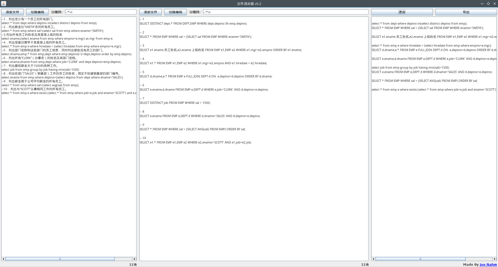

# fileBlender 文件混合器
一个可以把两个文件分块，然后随机抽取组成新文件的小程序

#### 下载地址

[点击下载 v0.2.1](https://github.com/Adream-Studio/fileBlender/releases/download/v0.2.1/fileBlender.jar)

#### 更新

v0.2.1 修复小bug：默认回车作为分隔符的情况下不能正确分割、混合文件

v0.2版本支持自定义分隔符，且分隔符支持正则表达式

#### 使用方法

1. 点击“添加文件”来导入你想要混合的两个文件。

2. 如果出现乱码，就点击相应的“切换编码”。

3. 默认以回车为分隔符。你也可以自定义分隔符，而且分隔符还支持正则表达式。

4. 点击“混合”即可随机生成混合好的内容。每点一次混合的效果都不同。

5. 点击“导出”即将混合结果保存成文件。

**注意！** 最佳的使用方式是，将左侧文件和右侧文件调整成块数相同的状态再进行混合。

#### 程序截图

